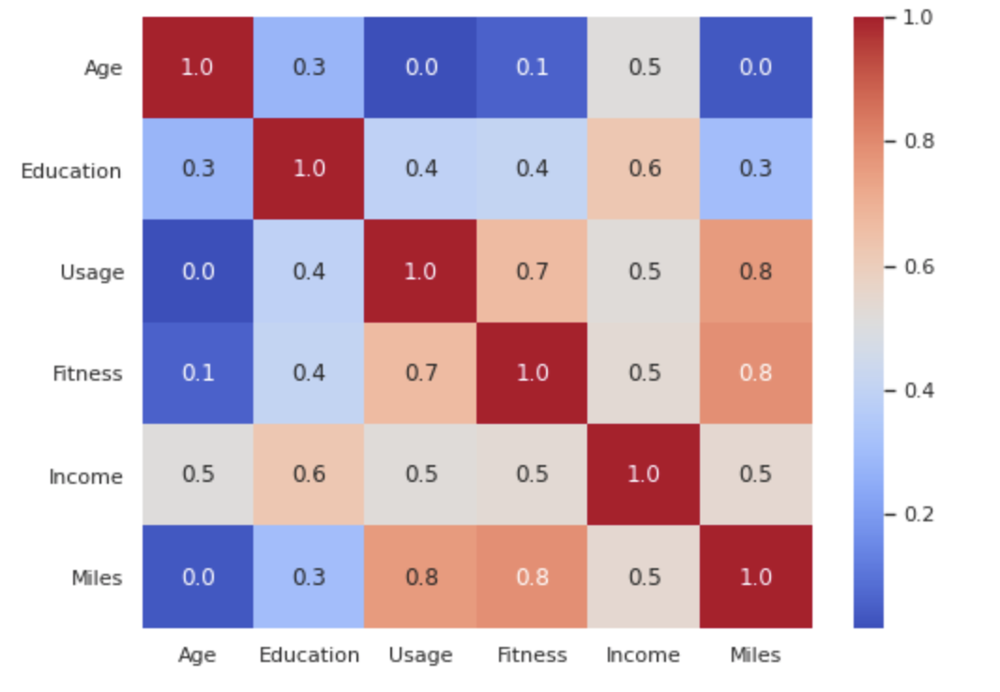

# Tiffany_Portfolio
Portfolio of Tiffany Ching

# [Project 1: Cardio Good Fitness Customer Profile Exploratory Data Analysis](https://github.com/chingnokyee/Cardio-Good-Fitness-Customer-Profile-EDA)
Given data on individuals who purchased a treadmill at a CardioGoodFitness retail store during the prior three months. Exploratory data analysis is performed on the dataset for analysing the customer profile. Recommendations for Cardio Good Fitness management to target new customer are provide at the end.

